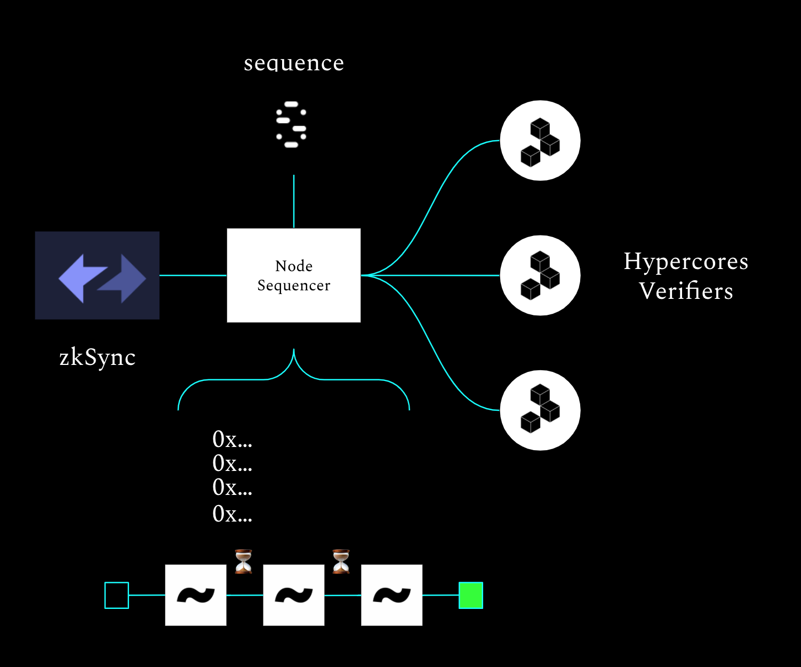

# zksync-l2-urbit-sequencer (talis)
Experiment to see if this would be possible to run a sequencer as a star operator to subsidize & batch transactions to save gas fees by combining NFT transfer transactions together with a single tx on a timely basis.

1. User logs into site with ens. 
2. User bridges funds to zksync & pays for planet.
3. User updates ENS records to store planet @p
4. Server listens to zksync events from contract addresses and stores a mapping for transactions to star operators contract address
5. Server batches NFT transfer txs on a timely basis, 7 days? Align around quarter moon cycles.

# talis arch tx flow
TODO

